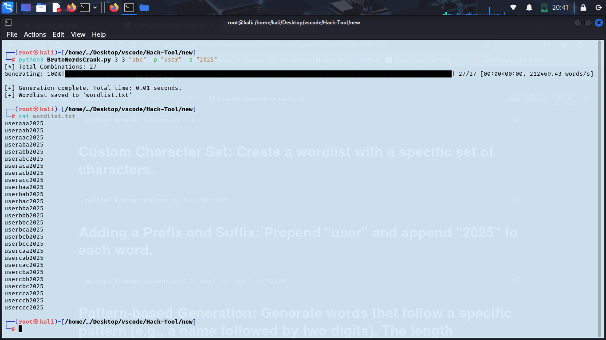

# BruteWordsCrank
# Requirements 
```
pip install tqdm
pip install multiprocessing
```
# Setup
```
git clone https://github.com/CryptoQuestVikas/BruteWordsCrank
cd BruteWordsCrank
python3 BruteWordsCrank.py
```

# Usage:
```
python3 BruteWordsCrank.py [-h] min_len max_len [charset] [-p PREFIX] [-s SUFFIX] [-t PATTERN] [-o OUTPUT] [-l LIMIT] [--progress]
```

# Basic Wordlist: Generate all 3 to 4-character lowercase words.
```
python3 BruteWordsCrank.py 3 4
```

# Custom Character Set: Create a wordlist with a specific set of characters.
```
python3 BruteWordsCrank.py 4 4 "abc123"
```

# Adding a Prefix and Suffix: Prepend "user" and append "2025" to each word.
```
python3 BruteWordsCrank.py 3 3 "abc" -p "user" -s "2025"
```

# Pattern-based Generation: Generate words that follow a specific pattern (e.g., a name followed by two digits). The length arguments are still #required but the pattern dictates the final length.
```
python3 BruteWordsCrank.py 6 6 -t "test%%" -o test_passwords.txt
```

> (This will generate test00, test01, ..., test99)

# Complex Pattern: Generate a password pattern with a lowercase word, a symbol, and two numbers.
```
python3 BruteWordsCrank.py 6 6 -t "@@@^%%"
```
# Large Wordlist with Progress and Limit: Generate a large wordlist of 8-character numbers, but stop after the first 1 million words and show progress.
```
python3 BruteWordsCrank.py 8 8 "0123456789" -o numeric_list.txt -l 1000000 --progress
```
# Screenshot

